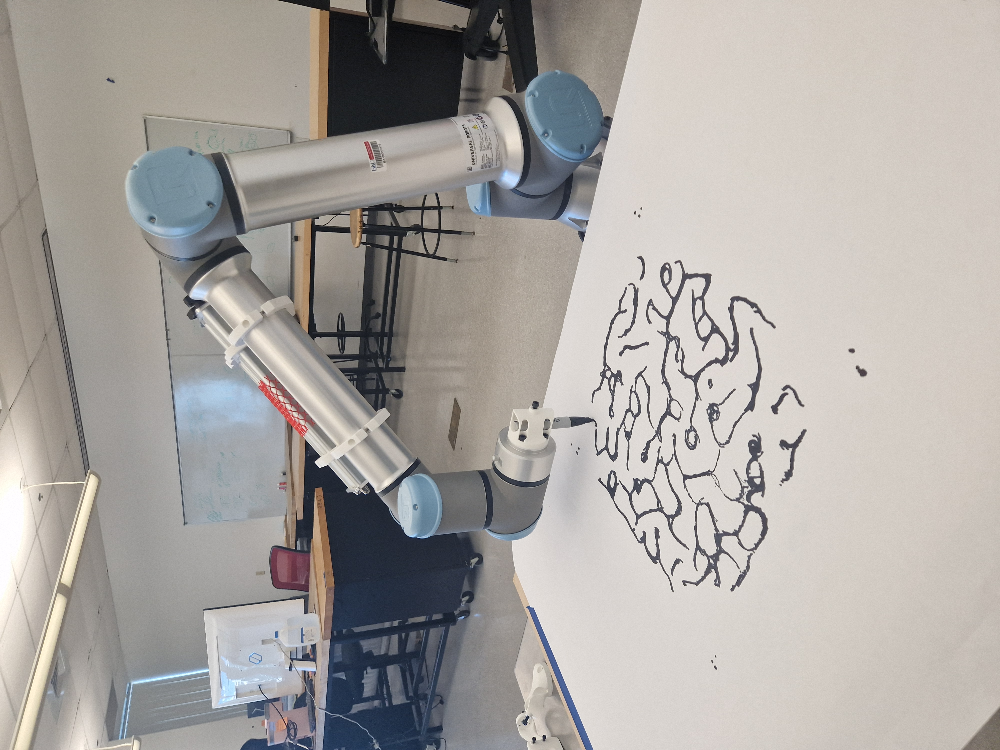

# Pen_Holders_on_UR10e
###### 2 pen holders to mount on the UR10e

## Overview
This repository contains everyting needed to get started with drawing with the [Universal Robot UR10e](https://www.universal-robots.com/products/ur10-robot/) (or any UR model capable of handeling the weight).

Included in the repository are:

- 2 Pen Holders CAD Files: For 3D printing or customizing the original design,
- Grasshopper Definition.

## Photos and Videos

https://github.com/cxlso/Pen_Holders_on_UR10e/assets/29285706/0295c61d-8cc9-4971-8c4a-07f12ce59806

</img> </img> </img> </img> 

## Contributing

Contributions are welcome! Please submit a pull request or open an issue to discuss any changes or improvements.

## License

[![CC BY-NC-SA 4.0][cc-by-nc-sa-shield]][cc-by-nc-sa]

This work is licensed under a
[Creative Commons Attribution-NonCommercial-ShareAlike 4.0 International License][cc-by-nc-sa].

[![CC BY-NC-SA 4.0][cc-by-nc-sa-image]][cc-by-nc-sa]

[cc-by-nc-sa]: http://creativecommons.org/licenses/by-nc-sa/4.0/
[cc-by-nc-sa-image]: https://licensebuttons.net/l/by-nc-sa/4.0/88x31.png
[cc-by-nc-sa-shield]: https://img.shields.io/badge/License-CC%20BY--NC--SA%204.0-lightgrey.svg

## Acknowledgements

Special thanks to the teams and communities behind Rhino Grasshopper, Arduino, and Universal Robots for their support and resources.
